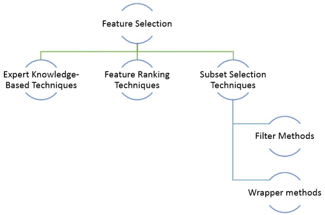
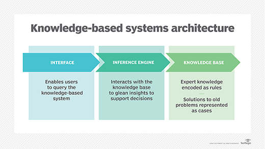
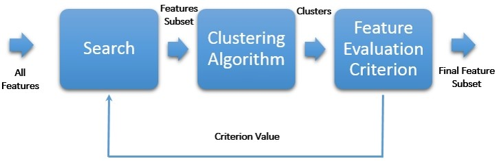
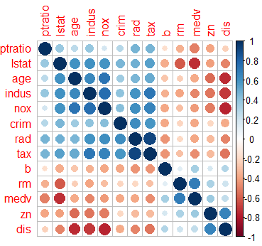
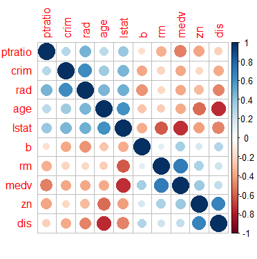

# Tutorial 6 - Feature Selection  
**Data Exploration & Preparation**  
**Lecturer: Dr. Muhammad Iqbal**  
**Email: miqbal@cct.ie**  
CCT College Dublin

## Agenda
1. [**Introduction**](#introduction-feature-selection--engineering)
2. [**Importance of Feature Selection**](#2-importance-of-feature-selection--engineering)
3. [**Feature Selection**](#3-feature-selection)
4. [**Feature Selection Techniques**](#4-feature-selection-techniques)
5. [**Expert Knowledge-based Techniques**](#5-expert-knowledge-based-techniques)
6. [**Feature Ranking**](#6-feature-ranking)
7. [**Subset Selection Techniques**](#7-subset-selection-techniques)
8. [**Embedded Methods**](#8-embedded-methods)
9. [**Wrapper Methods**](#9-wrapper-methods)
10. [**Filter Methods**](#10-filter-methods)

---

### Introduction: Feature Selection & Engineering

In this lecture, the focus is on effectively utilizing the features of a dataset to build a high-performing model.

- **Feature Selection** helps identify which features (or variables) are most important for the model's performance. It involves scoring each feature based on its relevance to the target variable, and selecting the top features—like the top 10 or 15—that contribute the most to the model.

- **Feature Engineering** goes beyond just selecting features; it involves creating new features or transforming existing ones to improve model accuracy. By deriving new features, you can better represent the data and address underlying issues that might affect the model's predictive power.

In many datasets, the large number of features can make it hard to identify patterns, which reduces the model's effectiveness. Redundant or irrelevant features add noise and confuse the model. By applying **Feature Selection** and **Feature Engineering**, you reduce noise and improve the accuracy and efficiency of the model.

---

### 2. **Importance of Feature Selection & Engineering**

When applying **Feature Selection** and **Feature Engineering**, we aim to reduce the number of features (dimensionality) while maintaining the representation of all key variables. However, this reduction can decrease the explainable **variance**, which refers to the amount of information the model can extract from the data. Balancing dimensionality reduction and preserving important variance is crucial for maintaining model accuracy.

We focus on three main actions to improve model performance:

- **Feature Engineering**: Involves transforming or creating new features to ensure machine learning algorithms perform optimally. This can include scaling, encoding, or creating new variables based on existing data.
  
- **Selection**: Involves identifying and selecting the most important features that have the highest impact on the model’s performance. This step helps the model focus on the most relevant information.

- **Reduction**: Reduces the feature space by converting the dataset into a lower-dimensional representation. This helps to simplify the model and make it more efficient while maintaining as much information as possible.

---

### 3. **Feature Selection**

**Feature Selection** is the process of choosing a subset of important features to be used in creating a model. The goal is to select a small set of significant features that will contribute to the model’s performance, while avoiding features that are redundant or irrelevant. This reduces the complexity of the model and makes it easier to interpret.

- The **FSelector** package includes several scoring functions to assess each feature’s significance in relation to the target variable. These scoring functions help identify which features should be prioritized.
  
- Common scoring functions include:
  - **Information Gain**
  - **Gain Ratio**
  - **Chi-squared**

- The **Chi-squared** test is used to compute a score for each feature. This score reflects the difference between the observed and expected distributions of the feature relative to the target variable. A **higher feature score** indicates a smaller p-value, which means the feature has a stronger correlation with the target variable.

---

### 4. **Feature Selection Techniques**

#### Overview of Feature Selection Techniques:

- **Feature selection techniques** do not modify the representation of the original variables. Instead, they select a subset of features, preserving the meaning and interpretability of the variables.
  
- Some techniques, like **Unsupervised Feature Selection Algorithms**, do not require a classifier. Their goal is to identify features that contribute the most information to the dataset, rather than those that help make predictions.

The image below shows an overview of feature selection techniques:



We can summarize the benefits of **Feature Selection** into three main aspects:

1. **Reduction of the curse of dimensionality**: As the number of features in a dataset increases, models can suffer from the curse of dimensionality, making it harder to find meaningful patterns. Feature selection helps reduce the number of features, improving model performance.

2. **Efficiency**: Feature selection reduces the time and computational resources required to process models by focusing on the most relevant features.

3. **Interpretability**: Models become easier to interpret when they focus on the most important features, making it easier to understand the results.

There are several techniques for feature selection, such as **Expert Knowledge-based Techniques**, **Feature Ranking Techniques**, and **Subset Selection Techniques**.

---

### 5. **Expert Knowledge-based Techniques**
A **Knowledge-Based System (KBS)** is a type of artificial intelligence system designed to capture and utilize the knowledge of human experts to support decision-making.

- The architecture of a KBS typically includes:
  1. **Knowledge Base**: A collection of domain-specific information and expertise.
  2. **Inference Engine**: This component interacts with the knowledge base to generate insights and support decisions.
  3. **User Interface**: This enables users to interact with the system and query the knowledge base for information.

KBS are used in various fields to support problem-solving by providing expert knowledge encoded as rules or solutions to known problems. The figure below illustrates a typical architecture of a knowledge-based system:



Aqui está o trecho revisado, sem erros de digitação:

---

### **6. Feature Ranking**
**Feature Ranking** helps us understand which features (or variables) in a dataset are the most important when we're trying to make predictions. This process gives each feature a score based on how much it affects the target variable (the thing we're trying to predict).

- The method doesn't automatically remove any features. Instead, we decide which ones to keep based on how important we think they are.
  
- For example, if we have 14 features, we might want to only keep the top five based on their importance. The **Pearson correlation coefficient** (a measure of how closely two variables are related) can help us figure out which ones to keep.

---

### **Example: Dataset and Code**

#### **Boston Housing Dataset**

- **What is it?**: The **Boston Housing** dataset contains information about houses in different areas of Boston. It was collected in the 1970s and includes various details that might affect house prices, like crime rates and tax rates.
  
- **Where is it?**: You can find the dataset here in the repository: "./datasets/BostonHousing.csv"

- **What does it include?**:
  - **crim**: Crime rate in the area.
  - **zn**: Percentage of land for large residential homes.
  - **indus**: Percentage of land used for businesses.
  - **nox**: Amount of pollution (nitric oxide).
  - **rm**: Average number of rooms in houses.
  - **age**: Percentage of older houses.
  - **dis**: Distance to job centers.
  - **rad**: Access to highways.
  - **tax**: Property tax rate.
  - **ptratio**: Number of students per teacher.
  - **b**: Percentage of Black residents.
  - **lstat**: Percentage of lower-income residents.
  - **medv**: Median value of homes (in $1000s).

---

### **Code Implementation: Feature Ranking with Boston Housing Dataset**

1. **Loading the Necessary Packages**  
   Before we start working with the dataset, we need to load the right R packages. Here’s the code for that:

```r
# Loading necessary packages
suppressWarnings(
  suppressMessages(if (!require(FSelector, quietly=TRUE)) install.packages("FSelector"))
)
library(FSelector)
```

   **Explanation**:  
   - The FSelector package helps us calculate which features (columns in the dataset) are the most important.
   - The code above checks if the package is already installed. If not, it installs it and then loads it.

---

2. **Loading the Boston Housing Dataset**  
   Now, let's load the dataset we want to analyze.

```r
# Load the Boston Housing dataset
path <- "./datasets/BostonHousing.csv"  # Path to the dataset
Dataset <- read.csv(path, sep = ",", dec = ".", row.names = 1)
Dataset <- Dataset[-4]  # Removing the 4th column (if not needed)
str(Dataset)  # Checking the structure of the data
head(Dataset)  # Displaying the first few rows
```

   **Explanation**:  
   - We’re loading the **Boston Housing** dataset from the file path.
   - We use read.csv() to load the data. The sep and dec parameters tell R how the data is separated and how decimal points are formatted (important when working with international datasets).
   - The line Dataset <- Dataset[-4] removes the 4th column, which may not be useful for our analysis (this depends on what our professor has told us).
   - str(Dataset) shows the structure of the dataset, helping us check if everything loaded correctly.
   - head(Dataset) displays the first few rows of data so we can get a feel for what the data looks like.

---

3. **Calculating the Feature Importance (Ranking the Features)**  
   Now, we’ll rank the features based on their importance using the **correlation coefficient**.

```r
# Ranking the features based on their correlation with the target variable (medv)
Scores <- linear.correlation(medv ~ ., Dataset)
print(Scores)
```

   **Explanation**:  
   - The function linear.correlation() calculates the **Pearson correlation coefficient** for each feature. This tells us how strongly each feature is related to the target variable (in this case, **medv**, which is the median home value).
   - We use print(Scores) to display the results. The higher the score, the more important that feature is when trying to predict home prices.

---

4. **Selecting the Top 5 Features**  
   After calculating the importance of each feature, we now select the top 5 most important ones.

```r
# Selecting the top 5 most important features
Subset <- cutoff.k(Scores, 5)
print(as.data.frame(Subset))
```

   **Explanation**:  
   - We use cutoff.k(Scores, 5) to pick the top 5 features based on their importance. The function automatically selects the highest-ranked features.
   - as.data.frame(Subset) converts the subset into a more readable format and print() displays the result.

---

5. **Selecting Features by Percentage**  
   Sometimes we want to pick a certain percentage of the most important features, rather than a fixed number. Here’s how to do that:

```r
# Selecting 40% of the best features
Subset2 <- cutoff.k.percent(Scores, 0.4)
print(as.data.frame(Subset2))
```

   **Explanation**:  
   - cutoff.k.percent(Scores, 0.4) picks 40% of the most important features (which usually gives us similar results to selecting the top 5 features).
   - This method is useful when we don't know exactly how many features we want, but we know we want the "best" ones by a percentage.

---

6. **Using Information Gain for Feature Ranking**  
   Instead of using correlation, we can also use **Information Gain**, a method based on how much each feature tells us about the target variable.

```r
# Ranking features using Information Gain
Scores2 <- information.gain(medv ~ ., Dataset)
Subset3 <- cutoff.k(Scores2, 5)
print(as.data.frame(Subset3))
```

   **Explanation**:  
   - information.gain() is another way to measure the importance of features, focusing on how much each feature helps in predicting the target variable.
   - We again use cutoff.k(Scores2, 5) to select the top 5 features based on **Information Gain**.

---

7. **Comparing the Results**  
   Finally, let's compare the results of using the **correlation coefficient** vs. **information gain**. Both methods may give us slightly different sets of important features.

   **What we observed**:
   - Four out of five features were the same between the two methods, but one feature changed when we used **Information Gain**.
   - This shows us that the way we rank features (using different methods) can have an impact on which ones we think are most important.

---

### 7. **Subset Selection Techniques**

Subset Selection Techniques automatically determine the size of the feature subset, unlike ranking methods where we manually choose how many features to keep. These techniques use a quality measure of the features, combined with a heuristic search, to find the smallest possible subset of features without reducing model performance.

Subset selection techniques can be divided into:

- **Embedded Methods**  
- **Filter Methods**  
- **Wrapper Methods**

---

### 8. **Embedded Methods**
**Embedded methods** are feature selection techniques built directly into the model itself. While the model is learning, it also selects the most important features to improve its accuracy.

A great example of this is the **ewkm function** from the **wskm** package. This function performs **entropy-weighted k-means clustering**, where it calculates **weights** for each feature and assigns higher importance to those that are more useful for clustering.

---

### **Example: Iris Dataset and Code**

#### **Iris Dataset**

- **What is it?**: The **Iris dataset** is a famous dataset that contains measurements of 150 iris flowers. It includes data about the **sepal length**, **sepal width**, **petal length**, and **petal width** for three different species of flowers.
  
- **Where is it?**: This dataset is built into R, so we don’t need to load an external file. We can access it directly using `iris`.

- **What does it include?**:
  - **Sepal.Length**: The length of the flower’s sepal.
  - **Sepal.Width**: The width of the flower’s sepal.
  - **Petal.Length**: The length of the flower’s petal.
  - **Petal.Width**: The width of the flower’s petal.
  - **Species**: The type of iris flower (Setosa, Versicolor, Virginica).

---

### 9. **Wrapper Methods**

**Wrapper Methods** involve selecting a subset of features using **Heuristic Search Algorithms**, and the selected features

 are evaluated based on how well a specific model performs with those features. The process is iterative: features are tested, models are evaluated, and based on the evaluation, the feature set is updated.

#### **Key Characteristics of Wrapper Methods:**
- **Feature Selection**: Involves searching through all possible feature subsets, using a clustering or classification algorithm to evaluate each subset.
- **Disadvantages**: It can be computationally expensive, especially with large datasets, because it has to evaluate several models with different feature sets.
- **Supervised and Unsupervised**: While commonly associated with supervised learning, wrapper methods can also be adapted to unsupervised models, such as clustering.



#### [Learn More About Heuristic Search](./Heuristic_Search.md)

#### **Example: Wrapper Methods with clustvarsel**

The **`clustvarsel`** function is used to find the best subset of variables for model-based clustering. It performs variable selection to identify a locally optimal subset of features that contribute most to the clustering process. This can be done using a **forward-backward greedy search** approach.

```r
# Loading the required packages
install.packages("clustvarsel")
install.packages("mclust")
library(clustvarsel)
library(mclust)

# Reading a synthetic dataset
path <- "F:/CCT/Data_ExplorationAndPreparation/Tutorial_6/syntheticdata.csv"
Dataset <- read.csv(path, sep=",", dec=".", row.names=1)
head(Dataset)
```

---

### 10. **Filter Methods**

Filter methods assess each feature's importance by applying a metric, without requiring a machine learning model. The goal is to identify the most relevant features for a given task and eliminate redundancy. Common metrics include:

1. **Dependency metrics**: These predict the value of one feature based on another. An example is **correlation**, which evaluates how one feature changes in relation to another.
  
2. **Information metrics**: These compare the information provided by different features, such as **information gain** or **entropy**.
  
3. **Distance metrics**: These measure the separation between feature values, helping distinguish features based on their contribution to model accuracy.

We apply **Filter Methods** to remove features that introduce redundancy into our model. In this example, we'll use the **Boston Housing** dataset.

#### **Example Code**:

```r
# Loading Data
path <- "file:///C:/Users/munaw/Downloads/BostonHousing.csv"
Dataset <- read.csv(path, sep = ",", dec = ".", row.names = 1)
Dataset <- Dataset[-4]
head(Dataset, 3)
install.packages("caret")
install.packages("corrplot")
library(caret)
library(corrplot)

# Calculate correlation matrix
correlationMatrix <- cor(Dataset)

# Find attributes that are highly correlated
highlyCorrelated <- findCorrelation(correlationMatrix, cutoff=0.75)
highlyCorrelated

# Display highly correlated attributes
names(Dataset[,highlyCorrelated])
```

The variables with a higher correlation (above 0.75) are `indus`, `tax`, and `nox`. We can remove them to eliminate redundancy and improve model performance. The graphical comparison below shows the original correlation matrix and the updated matrix after redundant variables are removed.



